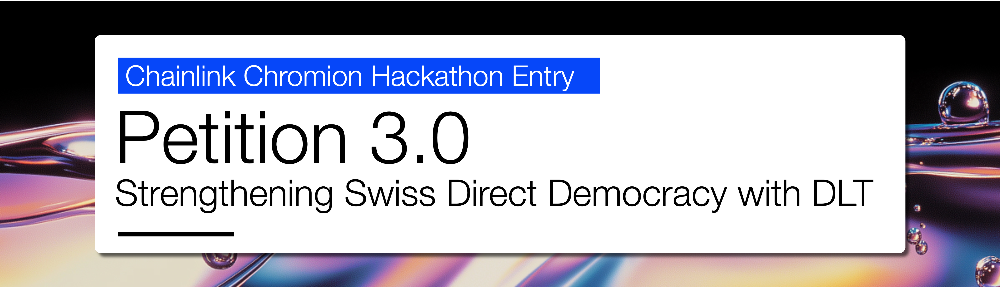

**Attention: This software is by no means secure and is not production ready. It is merely a proof of concept.**

This poject was developed for the Chainlink Chromion Hackathon in June 2025.

## Overview
Collecting signatures is an integral part of the [popular initiatives in Switzerland](https://en.wikipedia.org/wiki/Popular_initiative_in_Switzerland), which are a democratic instrument that allows people to propose new laws (as opposed to the parliament proposing new laws).
Collecting signatures on paper is costly and not secure - just last year a large scale signature copying/forging scheme that had compromised multiple popular initiatives was [uncovered](https://www.news.admin.ch/de/nsb?id=102581).

The proposed application improves the situation greatly: Signatures can be collected over the internet. The [Swiss e-ID](https://www.eid.admin.ch/en/) is used to enforce constraints like minimum age or no more than one signature per person. Last but not least, the system allows for quasi anonymous signature collection, since no personal information of the citizen is visible in the smart contract, which is a great improvement over the traditional paper-based system. And of course, such a system would greatly reduce the costs of collecting signatures.

This is a novel application that finally proposes a DLT use case that goes beyond DeFi and actually brings value to the real world.

See this blog article for more details on DLT and Democracy: [Democracy 3.0](https://dss.swiss/2025/01/31/democracy-3-0/)

## Application Details
[Here's a video](https://www.youtube.com/watch?v=p8c95uogwUM) where the application is explained.

#### Explanation
The software consists of several components. We have a backend, that coordinates the process and serves the user interface. There's a verifier that verifies the e-ID - it can be accessed through APIs from the Backend or from the Decentralized Oracle Network. In our case, we use the verifier hosted by the Swiss government. Then there's the decentralized oracle network (DON) that ensures that the e-ID is valid and that the person is eligible to sign and finally the smart contract, where the signatures are counted.

1) A person opens the signature collecting webpage ([www.petition3.ch](www.petition3.ch))
2) The server triggers a new verification reqeust with the verifier.
3) The verifier returns a verification-id, which can be used to poll the status of the verification.
4) A QR code with a link to the verifier, including verification-id, is shown to the user.
5) The user scans the QR code, confirms the verification with his e-ID wallet app and thereby sends the verification info to the verifier.
6) The server periodically checks for, and now finds the verification results.
7) The verification id is encrypted and sent to the user. The encryption secret is sent to the DON for later. The verification-id is encrypted, because there is a risk of personal information being intercepted using the verification-id, if it were visible in the transaction that follows.
8) The User sends a transaction to the smart contract with the encrypted verification-id and the secret slot_id and version.
9) The smart contract passes that information to the DON
10) The oracles request the verification results (using the decrypted verification-id) from the verifier.
11) The verifier returns the information provided by the user. The oracles enforce signature eligibility (eg. age limit) and hash the unique person identifier (SSN), which they send back to the smart contract.
12) The smart contract checks if this unique person identifier has already been used to sign, and if not, increases the signature count by one.

